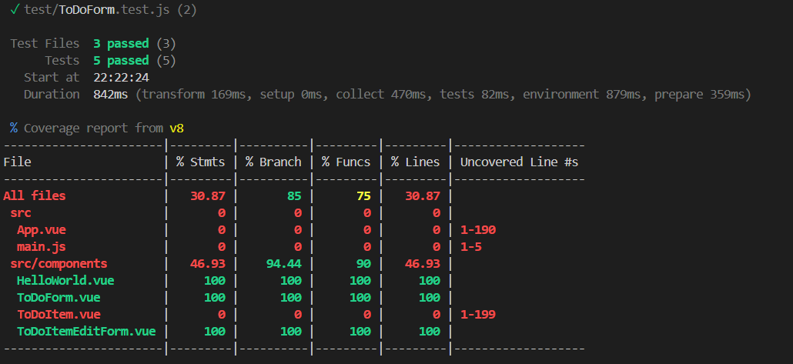
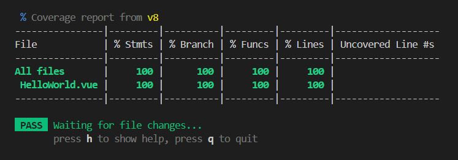
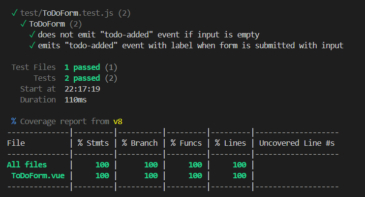
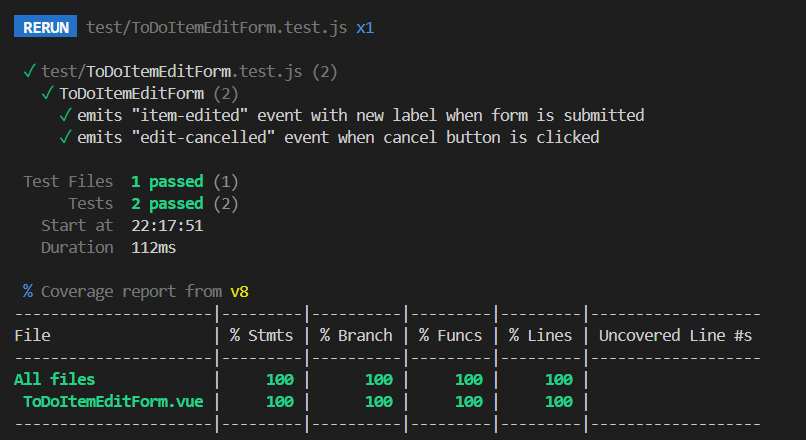

# todo-app-using-vue


## Getting Started

To get up and running, follow these steps:

```bash
npm install
```

### Compile and hot-reload for development

```bash
npm run dev
```

### Compile and minify for production

```bash
npm run build
```

### Lint files

```bash
npm run lint
```

### Format using Prettier

```bash
npm run format
```


## Tests suite
    
```bash
    npm run test
```
## Coverage Report on HelloWorld Component


    
1. **HelloWorld Component**:
   - Renders props.msg when passed.
2. **ToDoForm Component**:
   - Does not emit "todo-added" event if input is empty.
   - Emits "todo-added" event with label when form is submitted with input.
3. **ToDoItemEditForm Component**:
   - Emits "item-edited" event with new label when form is submitted.
   - Emits "edit-cancelled" event when cancel button is clicked.

## Coverage Report

<!-- add image from assets/coverage.png -->
## Coverage Report on HelloWorld Component


## Coverage Report on TodoForm Component


## Coverage Report on ToDoItemEditForm Component




## Built With

- [Vue.js](https://vuejs.org/) - The Progressive JavaScript Framework
- [Vue CLI](https://cli.vuejs.org/) - Standard Tooling for Vue.js Development
- [Vitest](https://vitejs.dev/guide/features.html) - Next Generation Frontend Tooling


