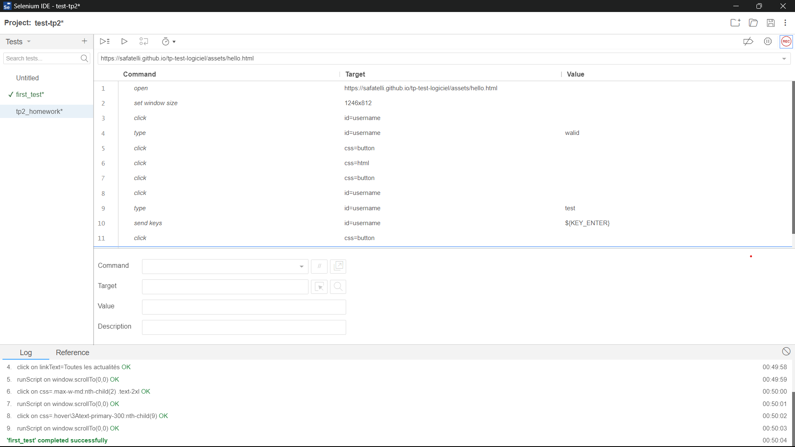
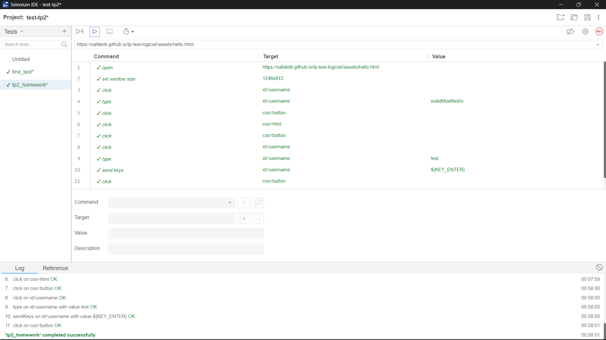
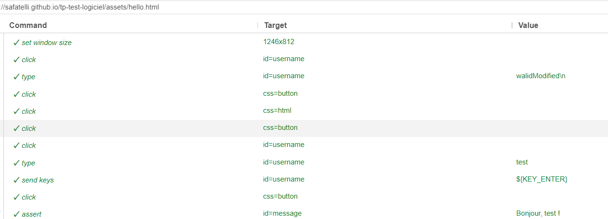
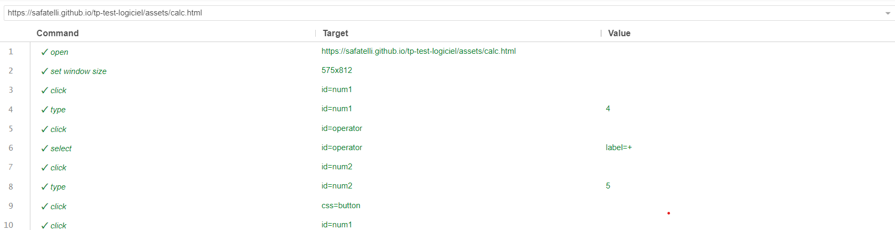
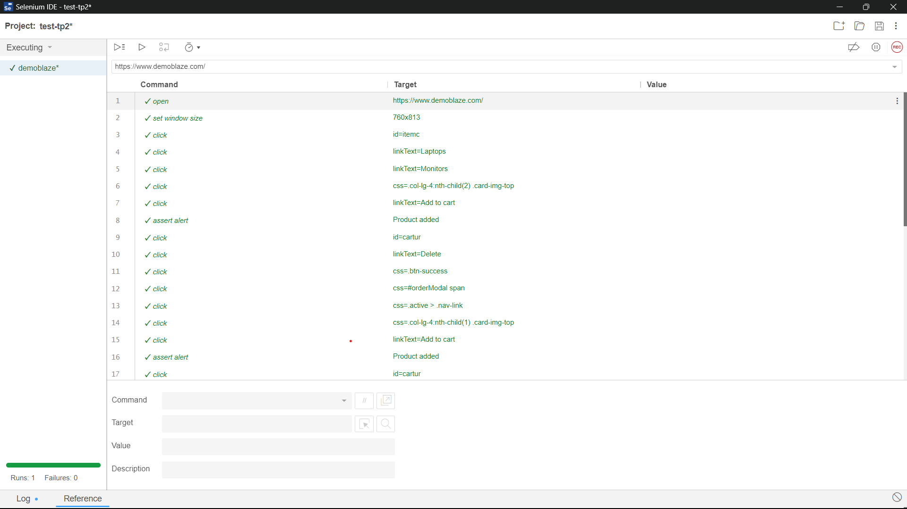

# Automated Testing with Selenium IDE

## Exercise 1: User Authentication Test

### Objective
Automate the testing of a user authentication process using Selenium IDE.

### Steps
1. Open Selenium IDE.
2. Create a new test in Selenium IDE.
3. Record a new test scenario using the recording tool.
4. Execute the test to verify its initial functionality.
5. Modify the script to change the value of the recorded username.
6. Add an "Assert Text" command to verify the displayed message after clicking the "Bonjour" button.
7. Execute the test script for two cases: one where the assertion succeeds and one where it fails, by modifying the username for each case.
8. Analyze the results and identify any discrepancies between expected and actual outcomes.
9. Make adjustments to the script if necessary to correct errors or assertion failures.

### Screenshots
- 
- 
- 

## Exercise 2: Calculator Functionality Test

### Objective
Automate the testing of various functionalities of a calculator using Selenium IDE.

### Steps
1. Record actions in Selenium IDE to test different calculator functionalities, covering addition, subtraction, multiplication, division, zero division, and empty input cases.
2. Add assertions to verify that the displayed results are correct.
3. Organize tests into logical suites for better management.
4. Execute tests to ensure they all pass successfully.

### Screenshots
- 

## Exercise 3: Demoblaze Website Testing

### Objective
Automate the testing of various functionalities of the Demoblaze website using Selenium IDE.

### Steps
1. Access the Demoblaze website in your browser.
2. Record actions in Selenium IDE to test different website functionalities, including navigation, adding products to the cart, checking out, searching, and exploring additional pages.
3. Use variables to store data such as product names, delivery addresses, etc., to make tests more dynamic and reusable.
4. Add assertions to verify that actions produce expected results.
5. Execute tests to ensure they all pass successfully.

### Screenshots
- 
